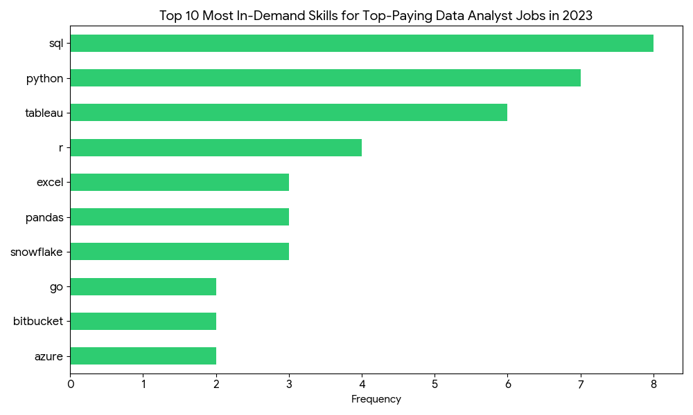

# Introduction
📊 Unlock insights into the data career landscape! This project investigates the current market for Data Analysts, specifically identifying 💰 premium-salary roles, 🔥 must-have technical competencies, and 📈 the "sweet spot" where high job availability intersects with top-tier compensation.

🔍 Explore the code: All SQL analysis scripts are located in the [project_sql folder](/project_sql/) directory

# Background
This project originated from a need to strategically navigate the data recruitment field. By pinpointing which skills actually drive salary growth and which are most frequently requested by employers, this analysis serves as a roadmap for finding high-value career opportunities.

The dataset is derived from a comprehensive SQL Course, providing a rich repository of job titles, compensation packages, geographic trends, and required tech stacks.

The questions I wanted to answer through my SQL queries were:
1. Which Data Analyst positions offer the highest annual pay?
2. What specific tools do these high-paying roles demand?
3. Which skills are most frequently cited across all job postings?
4. Which competencies are linked to the most significant salary bumps?
5. What are the most "optimal" skills to master for maximum ROI?
# Tools I used
To analyze the data analyst job market, I utilized a professional tech stack to ensure my findings were accurate, organized, and easily accessible:

- **SQL**: The primary tool used to explore the data. 
- **PostgreSQL**: The database engine used to house the data.
- **Visual Studio Code**: My central workspace for writing and testing scripts.
- **Git & GitHub**: My tools for version control and project hosting. 

# The Analysis
Each query for this project aimed at investigating specific aspects of the data analyst job market. Here’s how I approached each question:

### 1. Top Paying Data Analyst Jobs
To identify the highest-paying roles, I filtered data analyst positions by average yearly salary and location, focusing on remote jobs. This query highlights the high paying opportunities in the field.

```sql
SELECT
   job_id,
   job_title,
   job_location,
   job_schedule_type,
   salary_year_avg,
   job_posted_date,
   name as company_name
FROM
   job_postings_fact
LEFT JOIN company_dim ON job_postings_fact.company_id = company_dim.company_id
WHERE
   job_title_short = 'Data Analyst' AND
   job_location = 'Anywhere' AND
   salary_year_avg IS NOT NULL
ORDER BY
   salary_year_avg DESC
LIMIT 10;
```
Here's the breakdown of the top data analyst jobs in 2023:

- **Top Earner**: The "Data Analyst" role leads the list with a peak average salary of $650,000.
- **Large Pay Gap**: There is a massive drop-off of over $300,000 between the first and second-highest paying roles.
- **High Minimum Pay**: Every job in this top 10 list earns at least $184,000 per year.

_JobTitle.png)

*Bar graph visualizing the salary for the top 10 salaries for data analysts; Gemini generated this graph from my SQL query results*

### 2. Skills for Top Paying Jobs
To understand what skills are required for the top-paying jobs, I joined the job postings with the skills data, providing insights into what employers value for high-compensation roles.

```sql
WITH top_paying_jobs AS (
    SELECT
    job_id,
    job_title,
    salary_year_avg,
    name as company_name
    FROM
    job_postings_fact
    LEFT JOIN company_dim ON job_postings_fact.company_id = company_dim.company_id
    WHERE
    job_title_short = 'Data Analyst' AND
    job_location = 'Anywhere' AND
    salary_year_avg IS NOT NULL
    ORDER BY
    salary_year_avg DESC
    LIMIT 10
)

SELECT
    top_paying_jobs.*,
    skills
FROM top_paying_jobs
INNER JOIN skills_job_dim ON top_paying_jobs.job_id = skills_job_dim.job_id
INNER JOIN skills_dim ON skills_job_dim.skill_id = skills_dim.skill_id
ORDER BY
    salary_year_avg DESC; 
```


*Bar graph visualizing the count of skills for the top 10 paying jobs for data analysts; Gemini generated this graph from my SQL query results*

### 3.In-Demand Skills for Data Analysts
This query helped identify the skills most frequently requested in job postings, directing focus to areas with high demand.

```sql
SELECT
    skills,
    COUNT(skills_job_dim.job_id) AS demand_count
FROM job_postings_fact
INNER JOIN skills_job_dim ON job_postings_fact.job_id = skills_job_dim.job_id
INNER JOIN skills_dim ON skills_job_dim.skill_id = skills_dim.skill_id
WHERE
    job_title_short = 'Data Analyst'
GROUP BY
    skills
ORDER BY
    demand_count DESC
LIMIT 5;
```
Here's the breakdown of the most demanded skills for data analysts in 2023

- SQL and Excel remain fundamental, emphasizing the need for strong foundational skills in data processing and spreadsheet manipulation.
- Programming and Visualization Tools like Python, Tableau, and Power BI are essential, pointing towards the increasing importance of technical skills in data storytelling and decision support.

| Skill    | Demand Count |
|----------|-------------:|
| SQL      | 92,628       |
| Excel    | 67,031       |
| Python   | 57,326       |
| Tableau  | 46,554       |
| Power BI | 39,468       |

*Table of the demand for the top 5 skills in data analyst job postings*


